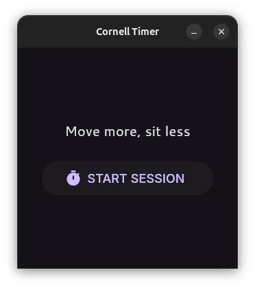

# Cornell Timer 

An Ubuntu desktop application designed to integrate the **Cornell 20-8-2 Rule** into your daily workflow.

## The 20-8-2 Rule
Developed by Dr. Alan Hedge, Professor of Ergonomics at Cornell University, this guideline divides every 30-minute work cycle to balance posture and circulation:

* **20 minutes:** Sit in an ergonomically neutral posture.
* **8 minutes:** Stand while working.
* **2 minutes:** Move, stretch, or walk around.

## Target Users
Ubuntu Linux users working at height-adjustable workstations.

## Application Screenshots

---

Developed by **Christian Elijah DC. Darvin**